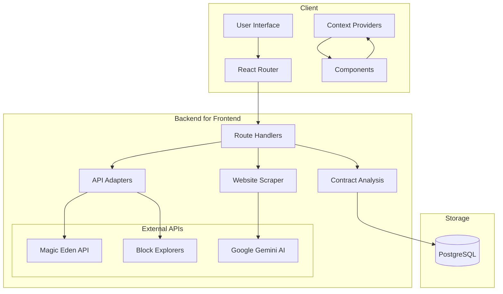
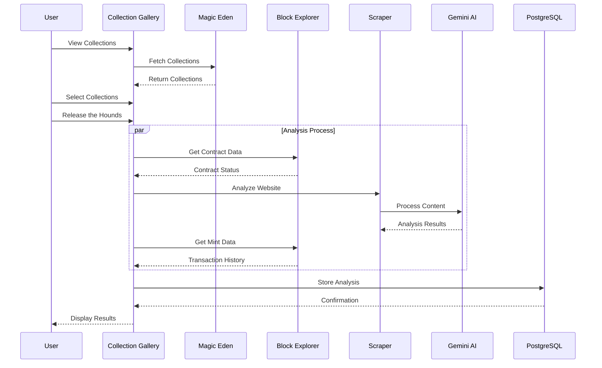
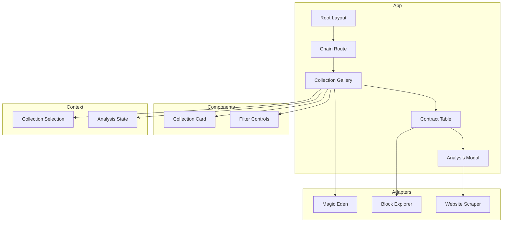
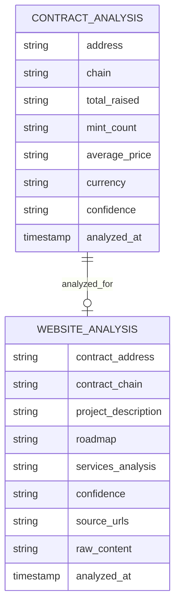
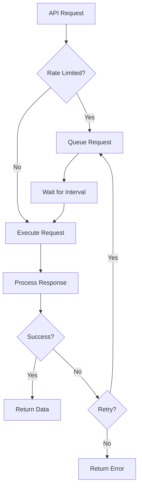

# Houndmaster System Diagrams

## System Overview

```mermaid
graph TB
    subgraph Client
        UI[User Interface]
        Router[React Router]
        Context[Context Providers]
        Components[Components]
    end

    subgraph BFF[Backend for Frontend]
        Routes[Route Handlers]
        Adapters[API Adapters]
        Scraper[Website Scraper]
        Analysis[Contract Analysis]

        subgraph External APIs
            ME[Magic Eden API]
            BE[Block Explorers]
            AI[Google Gemini AI]
        end
    end

    subgraph Storage
        DB[(PostgreSQL)]
    end

    UI --> Router
    Router --> Routes
    Components --> Context
    Context --> Components

    Routes --> Adapters
    Adapters --> ME
    Adapters --> BE

    Routes --> Scraper
    Scraper --> AI

    Routes --> Analysis
    Analysis --> DB
```

## Data Flow

```mermaid
sequenceDiagram
    participant User
    participant Gallery as Collection Gallery
    participant ME as Magic Eden
    participant BE as Block Explorer
    participant Scraper
    participant AI as Gemini AI
    participant DB as PostgreSQL

    User->>Gallery: View Collections
    Gallery->>ME: Fetch Collections
    ME-->>Gallery: Return Collections

    User->>Gallery: Select Collections
    User->>Gallery: Release the Hounds

    par Analysis Process
        Gallery->>BE: Get Contract Data
        BE-->>Gallery: Contract Status

        Gallery->>Scraper: Analyze Website
        Scraper->>AI: Process Content
        AI-->>Scraper: Analysis Results

        Gallery->>BE: Get Mint Data
        BE-->>Gallery: Transaction History
    end

    Gallery->>DB: Store Analysis
    DB-->>Gallery: Confirmation
    Gallery-->>User: Display Results
```

## Component Structure

```mermaid
graph TD
    subgraph App
        Root[Root Layout]
        Chain[Chain Route]
        Gallery[Collection Gallery]
        Table[Contract Table]
        Modal[Analysis Modal]
    end

    subgraph Components
        Card[Collection Card]
        Filters[Filter Controls]
    end

    subgraph Context
        Selection[Collection Selection]
        Analysis[Analysis State]
    end

    subgraph Adapters
        ME[Magic Eden]
        Explorer[Block Explorer]
        Scraper[Website Scraper]
    end

    Root --> Chain
    Chain --> Gallery
    Gallery --> Card
    Gallery --> Filters
    Gallery --> Table
    Table --> Modal

    Gallery --> Selection
    Gallery --> Analysis

    Gallery --> ME
    Table --> Explorer
    Modal --> Scraper
```

## Database Schema

```mermaid
erDiagram
    WEBSITE_ANALYSIS {
        string contract_address
        string contract_chain
        string project_description
        string roadmap
        string services_analysis
        string confidence
        string source_urls
        string raw_content
        timestamp analyzed_at
    }

    CONTRACT_ANALYSIS {
        string address
        string chain
        string total_raised
        string mint_count
        string average_price
        string currency
        string confidence
        timestamp analyzed_at
    }

    CONTRACT_ANALYSIS ||--o| WEBSITE_ANALYSIS : "analyzed_for"
```

## Rate Limiting Flow

```mermaid
flowchart TD
    A[API Request] --> B{Rate Limited?}
    B -- Yes --> C[Queue Request]
    B -- No --> D[Execute Request]
    C --> E[Wait for Interval]
    E --> D
    D --> F[Process Response]
    F --> G{Success?}
    G -- Yes --> H[Return Data]
    G -- No --> I{Retry?}
    I -- Yes --> C
    I -- No --> J[Return Error]
```
